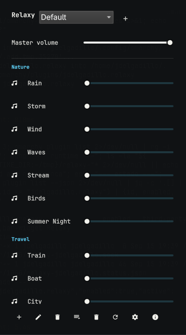

# Relaxy

Relaxy is an unofficial Omarchy shell plugin for mixing ambient sounds while
working, focusing, reading, or resting. It recreates the bundled sound
experience of [Blanket](https://github.com/rafaelmardojai/blanket) as a native
Omarchy bar widget with a persistent GStreamer mixer.

## Features

- Four sound groups: Nature, Travel, Interiors, and Noise.
- All fourteen bundled Blanket sounds, including pink and white noise.
- Independent volume and mute/play controls for every sound.
- Master volume, play/pause, presets, and inactive-group filtering.
- Custom sound files selected through the native file picker.
- Preset and custom-sound rename/remove workflows.
- Optional start-paused behavior and suspend inhibition.
- Automatic pause when the system enters power-saver mode.
- MPRIS controls for desktop media controls and keyboard media keys.
- Sound errors reported in the panel and the shell log.
- State persistence below `$XDG_STATE_HOME/relaxy/state.json`.
- Automatic backend restart while the Omarchy shell remains alive.

## Requirements

Relaxy is designed for Omarchy 4 or newer and expects these runtime
components, which are included by the standard Omarchy installation:

- Quickshell with the Omarchy `qs.Commons` and `qs.Ui` modules.
- GJS with GObject introspection.
- GStreamer with `audiomixer`, `uridecodebin`, `audiotestsrc`, and the normal
  audio output plugins.
- A user session D-Bus for MPRIS integration.

## Installation

Review the repository before installing it because Omarchy plugins run as
trusted, unsandboxed code inside the long-lived shell process.

```bash
omarchy plugin add https://github.com/JorgeDelgadillo/omarchy-relaxy.git --enable
```

The `--enable` flag adds the widget to the bar. Without it, enable the plugin
later with:

```bash
omarchy plugin enable jdelgadillo.relaxy --section right
```

For a local checkout, validate it first and then use a local Git transport if
your Omarchy installation permits local sources:

```bash
omarchy plugin validate /absolute/path/to/omarchy-relaxy
omarchy plugin add file:///absolute/path/to/omarchy-relaxy --enable --yes
```

After installation, restart the shell if it does not rescan automatically:

```bash
omarchy restart shell
```

## Uninstallation

Remove the plugin, its bar entry, and the loaded service:

```bash
omarchy plugin remove jdelgadillo.relaxy --yes
```

The command unloads the widget and deletes the plugin folder under
`~/.config/omarchy/plugins/`. If the bar still shows the widget, reload the
shell with `omarchy restart shell`.

The state file is kept so reinstalling preserves presets, volumes, and custom
sounds. Delete it explicitly to reset Relaxy:

```bash
rm -rf "${XDG_STATE_HOME:-$HOME/.local/state}/relaxy"
```

The backend removes its socket and status file when it exits. If an abrupt
shell unload leaves stale runtime files behind, remove them with:

```bash
rm -f "${XDG_RUNTIME_DIR:-/tmp}/relaxy-$USER.sock" "${XDG_RUNTIME_DIR:-/tmp}/relaxy-$USER.status.json"
```

## Usage



Click the Relaxy bar icon to open the mixer. Left and right click both toggle
the panel, while middle click toggles playback without opening it. The panel
contains the master control, per-sound sliders, preset controls, custom sound
import, settings, and attribution information.

Relaxy starts the bundled tracks muted at zero volume. Select a sound row to
enable it, then adjust its volume. A preset stores the active sound levels,
mutes, and inactive-group preference.

The backend exposes `org.mpris.MediaPlayer2.Relaxy` on
`/org/mpris/MediaPlayer2`. Desktop media controls can play, pause, stop, and
change the master volume; next and previous move between presets.

## Data and runtime paths

- Bundled audio: `assets/sounds/` inside the installed plugin.
- Persistent state: `$XDG_STATE_HOME/relaxy/state.json`, falling back to
  `$HOME/.local/state/relaxy/state.json`.
- Backend socket: `$XDG_RUNTIME_DIR/relaxy-$USER.sock`.
- Runtime status: `$XDG_RUNTIME_DIR/relaxy-$USER.status.json`.

The socket and the status file are local to the user and are removed when the
backend exits. State and status writes use a temporary file followed by an
atomic rename.

## Development and validation

All source code, comments, tests, and documentation in this repository are in
English. Run the fast checks from the repository root:

```bash
./scripts/check.sh
./tests/check_catalog.sh
(cd assets && sha256sum -c SHA256SUMS)
gjs -m tests/model.test.js
RELAXY_AUDIO_SINK=fakesink gjs -m tests/mixer.test.js
./tests/ui_contract.sh
./tests/service_contract.sh
```

The mixer regression test generates a short OGG file and verifies that a
finite sound is recycled in a single-file mix, alongside a bundled recording,
and alongside live noise. It also covers branch failures and explicit retries.
It runs in a few seconds and does not depend on the duration of the bundled
tracks. The catalog check also compares `assets/catalog.json` with the backend
and panel sound definitions.

Run the socket and MPRIS integration test in a session that permits temporary
Unix sockets:

```bash
./tests/integration.sh
```

Contributor and agent working context, including the GStreamer invariants that
must be preserved, is documented in
[`docs/DEVELOPMENT.md`](docs/DEVELOPMENT.md).

Each planned implementation step is represented by its own local Git commit.
This project intentionally does not push commits or require a remote.

## Attribution and licenses

The bundled audio catalog is derived from Blanket commit
`59c6665f9405f7b58df9b8a47fda431653c1696d`. Individual sound licenses and
attributions are recorded in
[`assets/SOUNDS_LICENSES.md`](assets/SOUNDS_LICENSES.md), and checksums are in
[`assets/SHA256SUMS`](assets/SHA256SUMS).

The plugin implementation is licensed under GPL-3.0-or-later. See
[`LICENSE`](LICENSE) for the full license text. Blanket remains the original
upstream project and its own licensing terms apply to its source and assets.

## Troubleshooting

If the icon is absent, verify that the plugin is enabled and that its entry is
present in the bar layout. If playback is silent, check that GStreamer can
load an audio sink and that another application has not claimed an exclusive
device. Run the mixer test with `RELAXY_AUDIO_SINK=fakesink` to isolate the
mixer from the physical audio device.

When several sounds are active, a finite recording can reach end-of-stream
before the other branches. Relaxy schedules a safe pipeline recovery and
rebuilds the active mix. If controls stop responding, inspect the Omarchy
Shell log and restart the shell; do not delete the state file unless resetting
the user's presets and volumes is intentional.

Backend diagnostics are written to the Omarchy shell log. The backend reports
missing or unreadable custom files as sound-specific errors and keeps the
remaining tracks available. The panel shows the last error with a dismiss
button, and touching the affected sound retries it.
